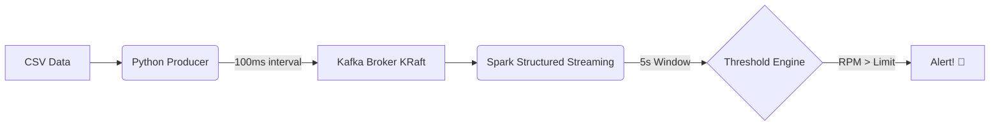

# Real-Time Telemetry Alerting 🏎️💨

Este proyecto implementa una arquitectura de telemetría en tiempo real para sim racing, utilizando Docker, Kafka y Spark Structured Streaming.

## Arquitectura

El flujo de datos es el siguiente:



### Componentes

1.  **Productor (Python)**: Lee datos de un CSV (Kaggle) y los envía a Kafka cada 100ms.
2.  **Broker (Kafka)**: Gestiona la ráfaga de datos entrantes (usando KRaft para simplicidad).
3.  **Consumidor (Spark Structured Streaming)**: Procesa los datos en ventanas de 5 segundos y dispara alertas críticas.

## Setup

1.  **Levantar Infraestructura**:
    ```bash
    docker-compose up -d
    ```

2.  **Ejecutar Productor**:
    ```bash
    cd producer && python producer.py
    ```

3.  **Ejecutar Consumidor**:
    ```bash
    cd spark-consumer && spark-submit spark_processor.py
    ```
