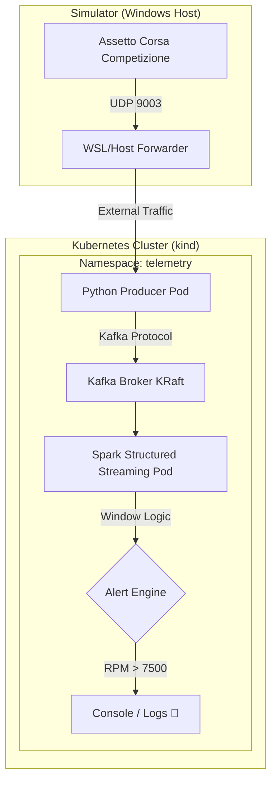

# 🏎️💨 Telemetry Real-Time Alerting (K8s Edition)

🚀 **Real-Time Telemetry Architecture for Sim Racing** using Assetto Corsa Competizione (ACC), Python, Kafka, and Spark Structured Streaming, all orchestrated in **Kubernetes**.

This project transforms raw telemetry data from a simulator into critical alerts processed in micro-time windows, allowing for the instant detection of engine failures, over-revs, or anomalous car behavior.

---

## 🏗️ System Architecture

The solution utilizes a modern, decoupled, and scalable stream processing architecture:



### 🧩 Components

1.  **ACC (Data Source)**: Generates high-frequency telemetry via UDP (Shared Memory).
2.  **Producer (Python 3.9)**: Acts as a *bridge*. It listens for UDP packets, cleans the data, and publishes it to the `telemetry-acc` Kafka topic.
3.  **Broker (Apache Kafka KRaft)**: The heart of messaging. Handles thousands of events per second with full resilience.
4.  **Consumer (Apache Spark 3.5)**: Massive processing engine. Analyzes telemetry in **5-second sliding windows**, calculates averages, and triggers alerts if configured limits are exceeded.

---

## 🚀 3-Minute Deployment

To deploy this project in your local **Kubernetes (kind)** cluster:

### 1. Build Images locally
Prepare the containers for the cluster:
```bash
docker build -t acc-producer:latest ./producer
docker build -t spark-consumer:latest ./spark-consumer
```

### 2. Load into Cluster
Since we are using `kind`, we inject the images manually (no Docker Hub needed):
```bash
kind load docker-image acc-producer:latest --name airbyte-abctl-control-plane
kind load docker-image spark-consumer:latest --name airbyte-abctl-control-plane
```

### 3. Deploy Manifests!
Spin up the entire infrastructure with a single command:
```bash
kubectl apply -f kubernetes/kafka/k8s-kafka.yaml
kubectl apply -f kubernetes/producer/k8s-producer.yaml
kubectl apply -f kubernetes/spark-consumer/k8s-consumer.yaml
```

---

## 🛠️ Monitoring and Debugging

- **Check Pod Status**: `kubectl get pods -n telemetry`
- **View Real-Time Alerts**: `kubectl logs -f deployment/spark-consumer -n telemetry`
- **View Raw Telemetry**: `kubectl logs -f deployment/acc-producer -n telemetry`

---

## ☸️ Why Kubernetes?

*   **Resilience**: If the Kafka broker or Spark consumer fails, K8s restarts them in milliseconds.
*   **Scalability**: Have 20 cars on track? Scale the `spark-consumer` to process multiple streams in parallel.
*   **Portability**: The same code running on your PC can be deployed to AWS (EKS) or Azure (AKS).

---

> [!TIP]
> **Pro Configuration**: If you want to receive telemetry from another PC, make sure to map UDP port 9003 in your system's Firewall.
