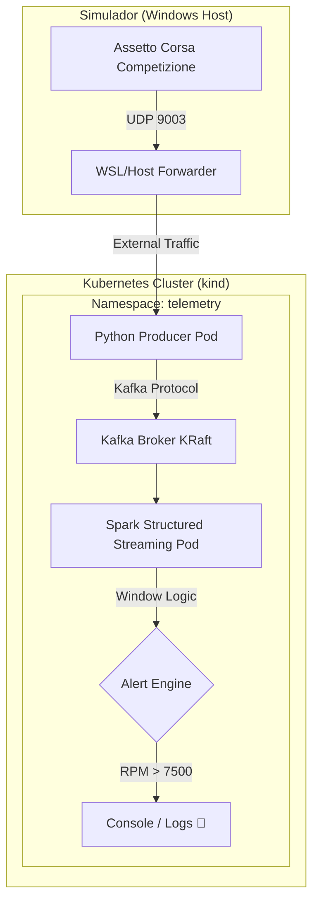

# 🏎️💨 Telemetry Real-Time Alerting (K8s Edition)

🚀 **Arquitectura de Telemetría en Tiempo Real para Sim Racing** utilizando Assetto Corsa Competizione (ACC), Python, Kafka y Spark Structured Streaming, todo orquestado en **Kubernetes**.

Este proyecto transforma los datos crudos de telemetría de un simulador en alertas críticas procesadas en micro-ventanas de tiempo, permitiendo detectar fallos, sobre-revoluciones o comportamientos anómalos al instante.

---

## 🏗️ Arquitectura del Sistema

La solución utiliza una arquitectura de procesamiento de flujo (Streaming) moderna, desacoplada y escalable:



### 🧩 Componentes

1.  **ACC (Fuente de Datos)**: Genera telemetría a alta frecuencia vía UDP (Shared Memory).
2.  **Productor (Python 3.9)**: Actúa como un *bridge*. Escucha los paquetes UDP, limpia los datos y los publica en el tópico `telemetry-acc` de Kafka.
3.  **Broker (Apache Kafka KRaft)**: El corazón de la mensajería. Gestiona el envío de miles de eventos por segundo con total resiliencia.
4.  **Consumidor (Apache Spark 3.5)**: Motor de procesamiento masivo. Analiza la telemetría en **ventanas deslizantes de 5 segundos**, calcula promedios y dispara alertas si se superan los límites configurados.

---

## 🚀 Despliegue en 3 Minutos

Para desplegar este proyecto en tu clúster local de **Kubernetes (kind)**:

### 1. Construir Imágenes localmente
Preparamos los contenedores para el clúster:
```bash
docker build -t acc-producer:latest ./producer
docker build -t spark-consumer:latest ./spark-consumer
```

### 2. Cargar en el Clúster
Como usamos `kind`, inyectamos las imágenes manualmente (sin necesidad de Docker Hub):
```bash
kind load docker-image acc-producer:latest --name airbyte-abctl-control-plane
kind load docker-image spark-consumer:latest --name airbyte-abctl-control-plane
```

### 3. ¡Desplegar Manifiestos!
Levantamos la infraestructura completa con un solo comando:
```bash
kubectl apply -f kubernetes/kafka/k8s-kafka.yaml
kubectl apply -f kubernetes/producer/k8s-producer.yaml
kubectl apply -f kubernetes/spark-consumer/k8s-consumer.yaml
```

---

## 🛠️ Monitoreo y Debugging

- **Ver Estado de los Pods**: `kubectl get pods -n telemetry`
- **Ver Alertas en Tiempo Real**: `kubectl logs -f deployment/spark-consumer -n telemetry`
- **Ver Telemetría Cruda**: `kubectl logs -f deployment/acc-producer -n telemetry`

---

## ☸️ ¿Por qué Kubernetes?

*   **Resiliencia**: Si el broker de Kafka o el consumidor de Spark fallan, K8s los levanta en milisegundos.
*   **Escalabilidad**: ¿Tienes 20 carros en pista? Escala el `spark-consumer` para procesar múltiples flujos en paralelo.
*   **Portabilidad**: El mismo código que corre en tu PC puede desplegarse en AWS (EKS) o Azure (AKS).

---

> [!TIP]
> **Configuración Pro**: Si quieres recibir la telemetría desde otro PC, asegúrate de mapear el puerto UDP 9003 en el Firewall de tu sistema.
