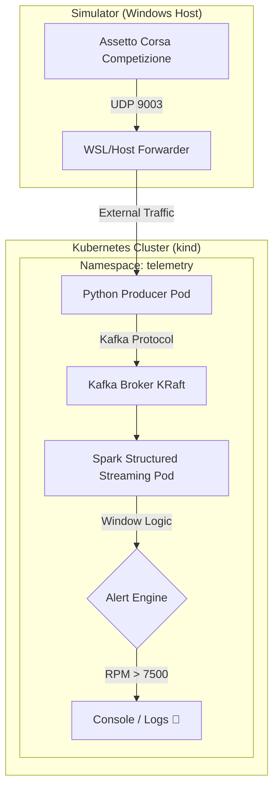

# 🏎️💨 Telemetry Real-Time Alerting (K8s Edition)

🚀 **Real-Time Telemetry Architecture for Sim Racing** using Assetto Corsa Competizione (ACC), Python, Kafka, and Spark Structured Streaming, all orchestrated in **Kubernetes**.

This project transforms raw telemetry data from a simulator into critical alerts processed in micro-time windows, allowing for the instant detection of engine failures, over-revs, or anomalous car behavior.

---

## 🏗️ System Architecture

The solution utilizes a modern, decoupled, and scalable stream processing architecture:


```mermaid
graph TD
    subgraph "Simulator (Windows Host)"
        ACC[Assetto Corsa Competizione] -->|UDP 9003| WF[WSL/Host Forwarder]
    end

    subgraph "Kubernetes Cluster (kind)"
        direction TB
        subgraph "Namespace: telemetry"
            P[Python Producer Pod] -->|Kafka Protocol| K[Kafka Broker KRaft]
            K --> S[Spark Structured Streaming Pod]
            S -->|Window Logic| A{Alert Engine}
            A -->|RPM > 7500| L[Console / Logs 🚨]
        end
    end

    WF -->|External Traffic| P
```

### 🧩 Components

1.  **ACC (Data Source)**: Generates high-frequency telemetry via UDP (Shared Memory).
2.  **Producer (Python 3.12)**: Acts as a *bridge*. It listens for UDP packets, cleans the data, and publishes it to the `telemetry-acc` Kafka topic. All settings (`UDP_PORT`, `KAFKA_BROKER`, `TOPIC`) are overridable via env vars for Docker/K8s.
3.  **Broker (Apache Kafka KRaft)**: The heart of messaging. Handles thousands of events per second with full resilience.
4.  **Consumer (Apache Spark 3.5)**: Massive processing engine. Analyzes telemetry in **5-second sliding windows**, calculates averages, and triggers alerts if configured limits are exceeded.
5.  **WhatsApp Race Engineer (`whatsapp-race-engineer/`)**: FastAPI service that turns a telemetry session into coaching: a natural-language answer (local LLM via Ollama, with deterministic fallback), a telemetry trend chart PNG, and a session insight diagram PNG. Exposes `POST /demo/query`, a browser preview at `GET /demo/preview`, and a WhatsApp Cloud API webhook at `/whatsapp/webhook`. See its own [README](whatsapp-race-engineer/README.md).

### 🗂️ Project Layout

```text
.
├── producer/               # UDP → Kafka bridge (ACC telemetry)
├── spark-consumer/         # Spark Structured Streaming alerts
├── whatsapp-race-engineer/ # FastAPI coaching bot (text + chart + diagram)
├── kubernetes/             # K8s manifests (kafka, producer, spark-consumer)
├── data/                   # Local telemetry samples (git-ignored dumps)
└── docker-compose.yml      # Local Kafka for dev without K8s
```

---

## 🚀 3-Minute Deployment

To deploy this project in your local **Kubernetes (kind)** cluster:

### 1. Build Images locally
Prepare the containers for the cluster:
```bash
docker build -t acc-producer:latest ./producer
docker build -t spark-consumer:latest ./spark-consumer
docker build -t whatsapp-race-engineer:latest ./whatsapp-race-engineer
```

### 2. Load into Cluster
Since we are using `kind`, we inject the images manually (no Docker Hub needed):
```bash
kind load docker-image acc-producer:latest --name airbyte-abctl-control-plane
kind load docker-image spark-consumer:latest --name airbyte-abctl-control-plane
kind load docker-image whatsapp-race-engineer:latest --name airbyte-abctl-control-plane
```

### 3. Deploy Manifests!
Spin up the entire infrastructure with a single command:
```bash
kubectl apply -f kubernetes/kafka/k8s-kafka.yaml
kubectl apply -f kubernetes/producer/k8s-producer.yaml
kubectl apply -f kubernetes/spark-consumer/k8s-consumer.yaml
kubectl apply -f kubernetes/whatsapp-race-engineer/k8s-whatsapp.yaml
```

The WhatsApp bot is reachable inside the cluster at `http://whatsapp-race-engineer.telemetry:8000` (`/demo/query`, `/demo/preview`, `/whatsapp/webhook`). It needs no Kafka access — it answers from the session slice it receives. Point `OLLAMA_BASE_URL` at your Ollama host for LLM narration, otherwise it uses the built-in fallback.

---

## 📱 WhatsApp Race Engineer (Local Dev)

```bash
cd whatsapp-race-engineer
python3 -m venv .venv && source .venv/bin/activate
pip install -r requirements.txt
cp .env.example .env
uvicorn app.main:app --reload --port 8001
```

Port `8000` is the default (`PORT` env makes it overridable, also in Docker via `-e PORT=...`). If you run Airbyte/`abctl` locally, it already owns `8000` — hence `8001` above.

Then `POST /demo/query` for coaching JSON (answer + chart + diagram URLs), or open `GET /demo/preview` for a WhatsApp-like mockup. Works without Ollama via a deterministic fallback narrator; set `OLLAMA_BASE_URL` in `.env` to enable the local LLM. Tests: `python -m unittest discover -s tests` (5 tests, all passing).

---

## 🛠️ Monitoring and Debugging

- **Check Pod Status**: `kubectl get pods -n telemetry`
- **View Real-Time Alerts**: `kubectl logs -f deployment/spark-consumer -n telemetry`
- **View Raw Telemetry**: `kubectl logs -f deployment/acc-producer -n telemetry`

---

## ☸️ Why Kubernetes?

*   **Resilience**: If the Kafka broker or Spark consumer fails, K8s restarts them in milliseconds.
*   **Scalability**: Have 20 cars on track? Scale the `spark-consumer` to process multiple streams in parallel.
*   **Portability**: The same code running on your PC can be deployed to AWS (EKS) or Azure (AKS).

---

> [!TIP]
> **Pro Configuration**: If you want to receive telemetry from another PC, make sure to map UDP port 9003 in your system's Firewall.
