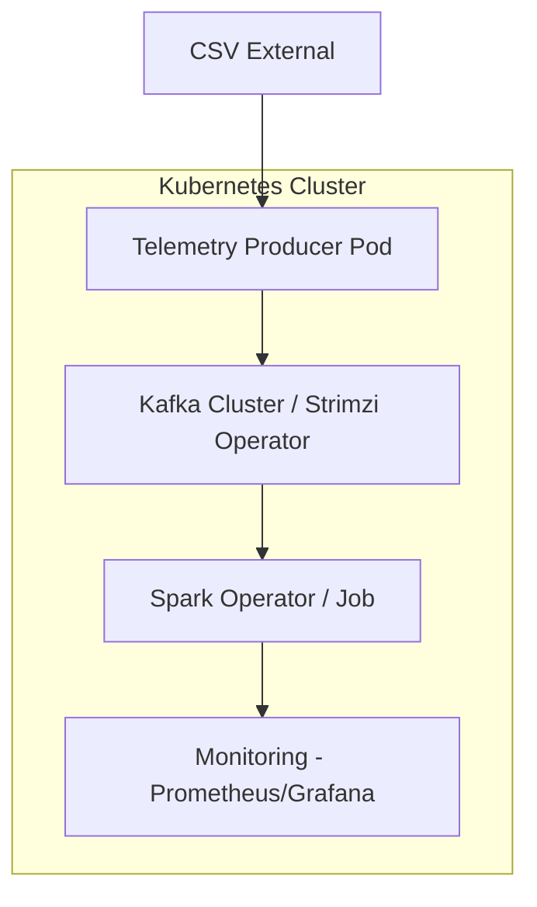

# ¿Hacerlo con Kubernetes? 🤔☸️

¡Es una excelente idea! Escalar un sistema de telemetría en tiempo real es el caso de uso perfecto para K8s. Aquí te dejo cómo se vería el plan de ataque:

## ¿Por qué Kubernetes?

1.  **Escalabilidad**: Podríamos tener múltiples réplicas del "Consumidor Spark" si el volumen de datos aumenta (por ejemplo, telemetría de toda la parrilla de F1).
2.  **Resiliencia**: Si el broker de Kafka falla, K8s lo levanta automáticamente.
3.  **Gestión de Recursos**: Spark en K8s es mucho más eficiente para gestionar memoria dinámica.

## Arquitectura K8s Propuesta

## Próximos Pasos (Opcional)

Para "darle duro" mañana, podríamos elegir:

*   **Opción A (Sencilla)**: Seguir con Docker Compose para prototipar rápido la lógica del Spark.
*   **Opción B (Hardcore)**: Usar Minikube o k3s local para desplegar todo con Helm Charts.

Mi recomendación: Terminemos el código del Productor y Consumidor en Compose y luego hacemos el "Helm-ify" para pasarlo a K8s. ¡Así dominamos los dos mundos!
